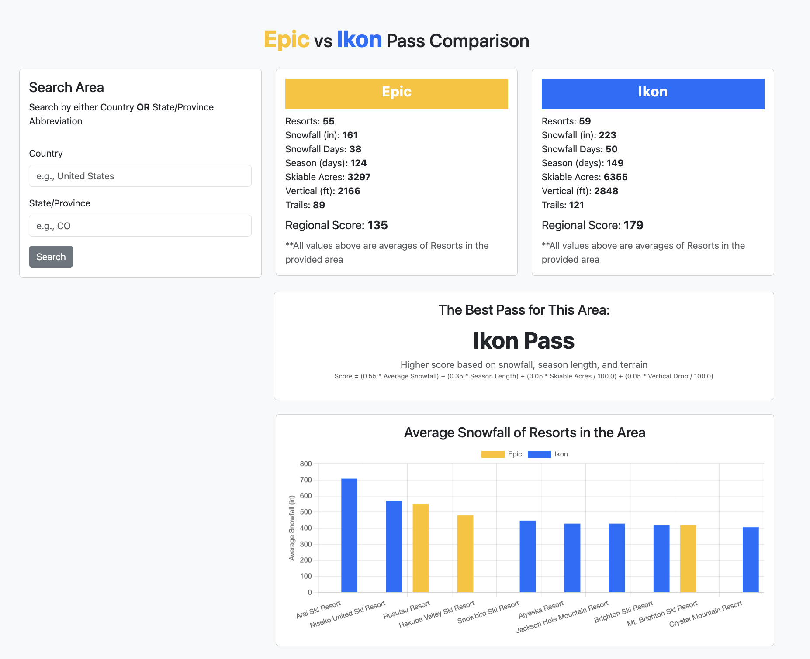

# Ski Pass Decision Dashboard
This project is a data analytics dashboard designed to help users compare Epic and Ikon ski passes by region. It analyzes snowfall, season length, terrain size, and resort availability to provide a data-driven recommendation.

The dashboard demonstrates full-stack development skills including ETL processing, SQL analytics, API development, and front-end data visualization.

## Dashboard Preview

## Features
- Compare Epic vs Ikon passes by country and state/province
- View average snowfall, terrain size, and season length
- See a data-driven pass recommendation
- Snowfall chart highlighting top resorts by region
- Interactive filters that update results in real time

## Technologies
### Backend
- Python
- Flask API
- SQLite database
- SQL analytics & aggregation

### Data Processing
- ETL pipeline using Python & CSV
- Data validation

### Frontend
- HTML, CSS, JavaScript
- Chart.js for chart

### Tools
- Git & GitHub
- VS Code

## Setup Instructions
### 1. Clone the repository
git clone https://github.com/YOUR-USERNAME/ski-pass-dashboard.git
cd ski-pass-dashboard

### 2. Create virtual environment
Recommend using python

### 3. Install dependencies
pip install -r requirements.txt

### 4. Load the database
python etl/etl_load.py

### 5. Run the server
python app/server.py

### 6. Open the dashboard
Open in the correct port

## Recommendation Methodology
A weighted scoring model compares passes using but can be altered:

- Snowfall (55%)
- Season length (35%)
- Skiable terrain (5%)
- Vertical drop (5%)

The pass with the higher score is recommended for the selected region.

## Project Structure
ski-pass-dashboard/
│
├── app/
│   ├── server.py
│   ├── static/app.js
│   └── templates/dashboard.html
│
├── data/
│   └── resorts.csv
│
├── etl/
│   └── etl_load.py
│
├── schema.sql
├── ski_pass.db
└── requirements.txt

## Future Enhancements

- Add skier experience level recommendations to match terrain
- Add days as a filter
- Include pass price
- Add resort populatarity to include crowds in calculation
